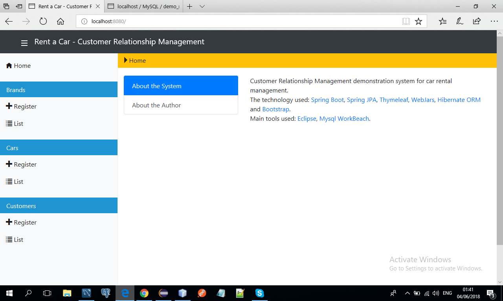
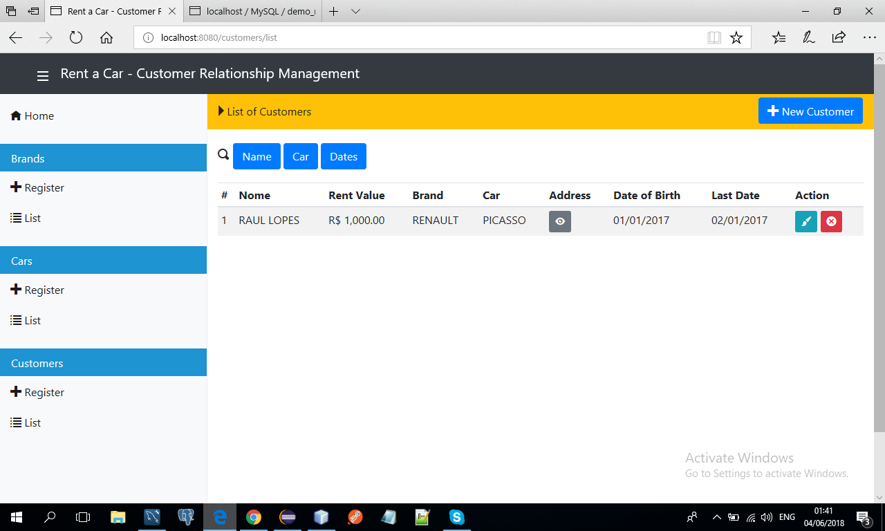
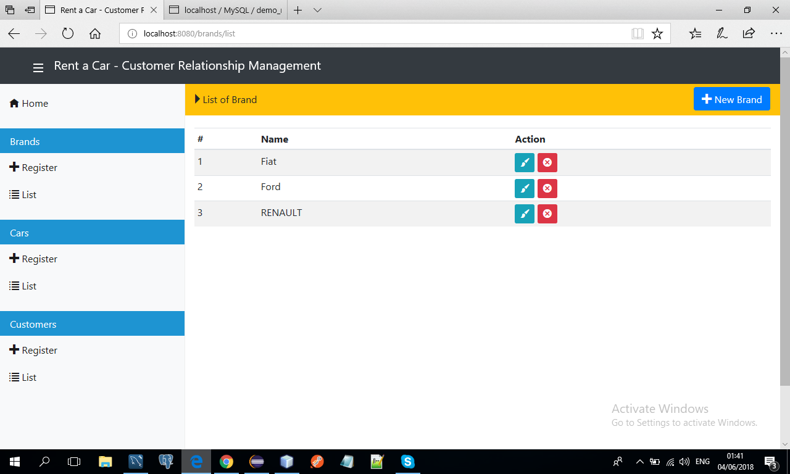

# Rent-Car CRM System

A Customer Relationship Management demonstration system for car rental management built with Spring Boot 3 and modern web technologies.



---

## Features

- **Modern UI/UX**: Premium Glassmorphism design with a responsive sidebar and smooth transitions.
- **Brand Management**: Add, edit, and list car brands (Fiat, Ford, Renault, etc.).
- **Car Inventory**: Register and manage available vehicles with brand associations.
- **Customer Management**: Comprehensive customer database with rental history and address details.
- **Rental Tracking**: Monitor rental dates, values, and customer-car associations.
- **Responsive Design**: Fully responsive interface optimized for desktop and mobile devices.

## Technology Stack

- **Java**: Version 25
- **Framework**: Spring Boot 3.5.8 (MVC, Data JPA)
- **Frontend**: Thymeleaf, Bootstrap 5, Custom CSS (Glassmorphism)
- **Database**: MySQL
- **Build Tool**: Maven

## Prerequisites

Before running the application, ensure you have the following installed:

- **Java Development Kit (JDK) 25**
- **Maven**
- **MySQL Server**

## How to Run

1.  **Clone the repository:**
    ```bash
    git clone https://github.com/Raul-Lopes/RentCar.git
    cd RentCar
    ```

2.  **Configure the Database:**
    - Create a MySQL database (e.g., `rentcar`).
    - Update `src/main/resources/application.properties` with your database credentials:
        ```properties
        spring.datasource.url=jdbc:mysql://localhost:3306/rentcar?createDatabaseIfNotExist=true&serverTimezone=UTC
        spring.datasource.username=your_username
        spring.datasource.password=your_password
        spring.jpa.hibernate.ddl-auto=update
        ```

3.  **Build the project:**
    ```bash
    mvn clean install
    ```

4.  **Run the application:**
    ```bash
    mvn spring-boot:run
    ```

5.  **Access the application:**
    Open your browser and navigate to: `http://localhost:8080`

## Project Structure

```
rent-car-crm/
├── src/main/java/       # Spring Boot application source code
├── src/main/resources/  # Templates (Thymeleaf), static assets (CSS, JS), and config
├── src/test/java/       # Unit and integration tests
└── pom.xml              # Maven dependencies and build configuration
```

## Screenshots

### List Of Customers


### List Of Brands


---
&copy; 2025 Raul Lopes. All rights reserved.